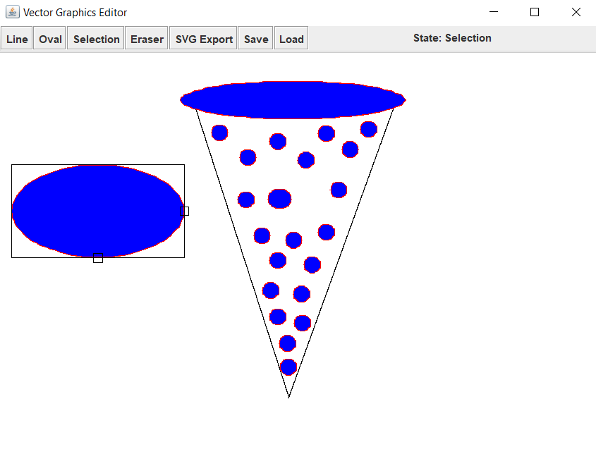

# Vector Graphics Editor

A very odd looking slice of pizza made in Vector Graphics Editor:



## What is it, in short?
A simple vector graphics editor made in Java Swing. Offers basic functionality such as adding, removing and updating basic shapes, as well as exporting the image in a native or SVG file format.

## What can it do?
Currently supported operations:
* Drawing lines
* Editing lines
* Drawing ovals
* Editing ovals
* Selecting graphical objects
* Reshaping selected objects
* Grouping objects into an object hierarchy
* Ungrouping objects from hierarchy
* Hand drawn curve eraser tool!

## File formats, saving, loading & exporting
* Export drawn image to SVG format!
* Save and load drawing in a native format!

## Native format specification
Each graphical object is defined by a single row in a text file.
Single row has a simple definition: `<shapeID> <data>`
* Line: @LINE x1 y1 x2 y2
* Oval: @OVAL hx hy vx vy (where h = horizontal hot-point and v = vertical hot-point)
* Composite: @COMP n (where n = number of children objects)

Pizza example above is therefore natively saved as such:
```
@OVAL 225 181 127 234
@OVAL 478 52 350 74
@LINE 345 390 466 56
@LINE 239 59 345 388
@COMP 3
@OVAL 355 355 345 365
@OVAL 354 328 344 338
@OVAL 371 305 361 315
@OVAL 343 298 333 308
@OVAL 370 272 360 282
@OVAL 335 268 325 278
@OVAL 343 234 333 244
@OVAL 382 239 372 249
@OVAL 398 202 388 212
@OVAL 361 211 351 221
@OVAL 325 206 315 216
@OVAL 307 165 297 175
@OVAL 349 164 335 152
@OVAL 412 154 402 164
@OVAL 446 85 436 95
@OVAL 425 108 415 118
@OVAL 398 90 388 100
@OVAL 375 120 365 130
@OVAL 343 99 333 109
@OVAL 309 117 299 127
@OVAL 277 89 267 99
@COMP 21
@COMP 2
@COMP 2
```

Thank you for reading! :smiley:
